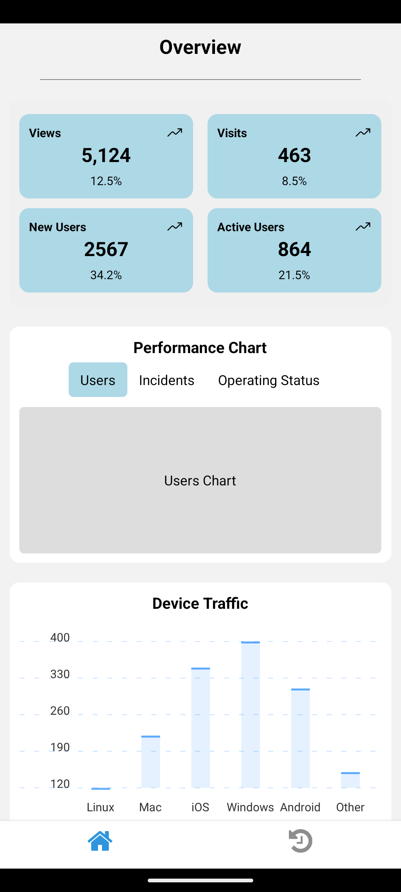
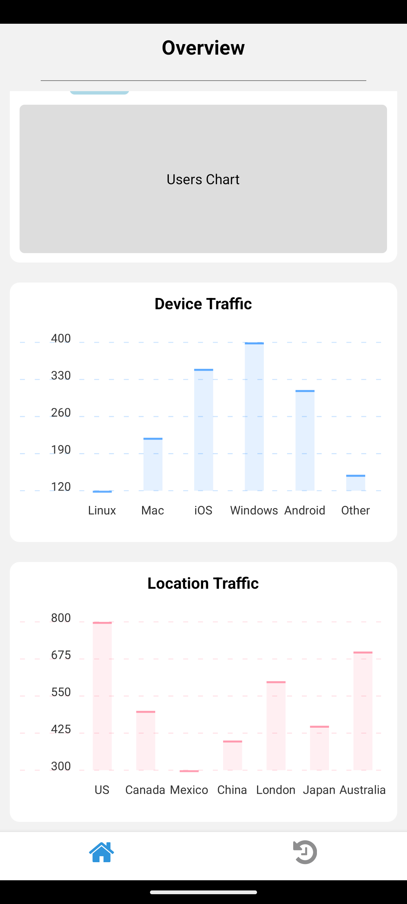

[](https://opensource.org/licenses/MIT)
[](https://reactnative.dev/)
[](https://expo.io/)

<div align="center">
    
</div>

<h1 align="center"> 📦 Mobile Dashboard UI</h1>

## Overview

The Mobile Dash UI is a responsive mobile dashboard template, meticulously crafted with React Native and Expo. It offers a sleek and intuitive interface for your mobile applications, enabling you to effortlessly manage and display a wide range of data in a visually stunning manner.

This UI template is highly customizable and serves as an ideal starting point for your mobile projects. Whether you're creating a social media app, a data analytics tool, or a personal finance manager, the Mobile Dash UI provides all the essential components and charts you need to kickstart your project.

---

## Screenshots
<div align="row">
 
 
</div>

---

## Features

- **Responsive Layout:** Tailored for both iOS and Android devices, ensuring a seamless user experience across platforms.
- **Pre-built Components:** Includes a variety of common UI components such as buttons, cards, modals, and lists, saving you valuable development time.
- **Data Visualization:** Integrated with customizable charts like bar charts, line charts, and pie charts, allowing you to present your data in a visually appealing way.
- **Navigation:** Equipped with a built-in navigation system using React Navigation, ensuring smooth transitions between screens.
- **Authentication Support:** Easily integrate Firebase Authentication for secure user login and signup.

---

## Installation

To get started with the Mobile Dash UI template, follow the instructions below:

### Prerequisites

Before running the project, make sure you have the following installed on your machine:

- **Node.js** (LTS version recommended): [Download Node.js](https://nodejs.org/)
- **Expo CLI**: Install Expo globally by running the following command:
  ```bash
  npm install -g expo-cli

### Steps

1. **Clone the repository:**
   ```bash
   git clone https://github.com/Pmvita/Mobile-Dash-UI.git
   cd Mobile-Dash-UI
   ```

2. **Install dependencies:**
   ```bash
   npm install
   ```

3. **Start the project:**
   ```bash
   expo start
   ```

4. **Run the project:**
   - You can use Expo Go on your mobile device to scan the QR code or run it on an Android/iOS emulator.

---

## Customization

To customize the Mobile Dash UI, follow these steps:

- Modify the colors and styling in the styles/ folder to match your branding or design preferences.
- Adjust the chart data in the charts/ folder to reflect the metrics you want to visualize.
- Add additional screens or components as needed based on your app’s features.

---

## Contributing

We welcome contributions to Mobile Dash UI! If you’d like to contribute, please follow these steps:

1. Fork the repository.
2. Create a new branch (git checkout -b feature/your-feature).
3. Make your changes and commit them (git commit -am 'Add new feature').
4. Push to the branch (git push origin feature/your-feature).
5. Create a pull request.

Please ensure that your contributions adhere to the code style and conventions used in the project. If you notice any issues or have suggestions, feel free to open an issue or a discussion.

---

## License

This project is licensed under the MIT License - see the LICENSE file for details.

---

## Contact

If you have any questions or need help with the project, feel free to reach out to the maintainers via the following:

- LinkedIn: https://www.linkedin.com/in/pierre-mvita/
- GitHub: https://github.com/Pmvita/Mobile-Dash-UI

### Sections included:

1. **Overview**: Briefly describes the purpose of the project.
2. **Features**: Lists the main features and benefits.
3. **Installation**: Provides the steps required to set up and run the project locally.
4. **Usage**: Explains how to start customizing and using the template.
5. **Customization**: Gives advice on how to make the app your own.
6. **Contributing**: Encourages others to contribute and details the process.
7. **License**: Clarifies the project's license terms.
8. **Contact**: Provides contact details for support or further questions.
